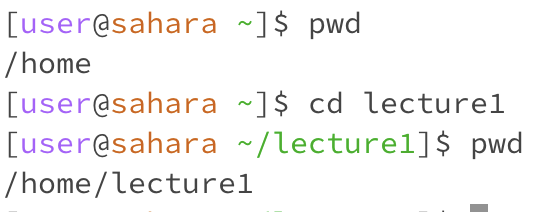
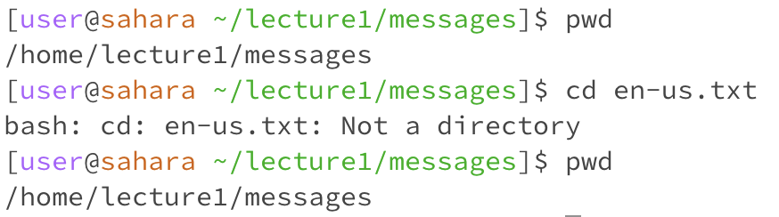
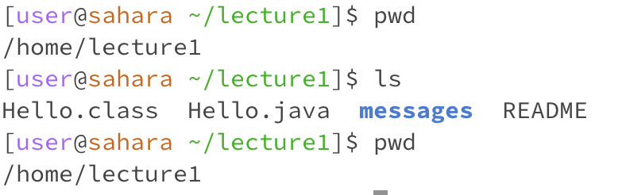
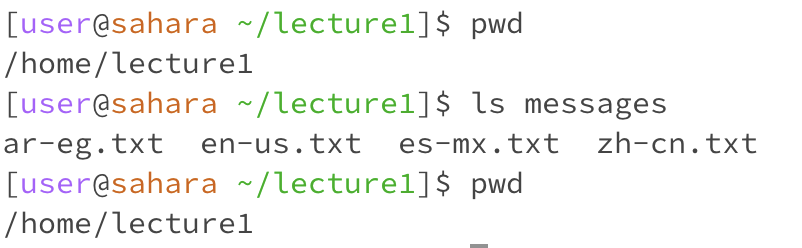
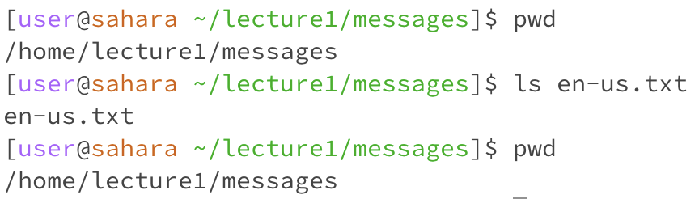
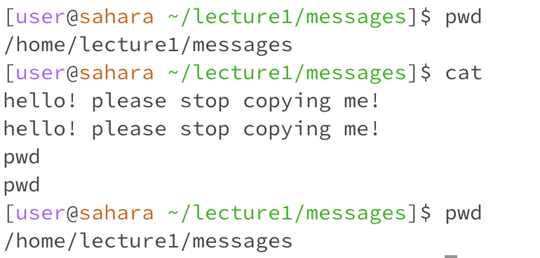
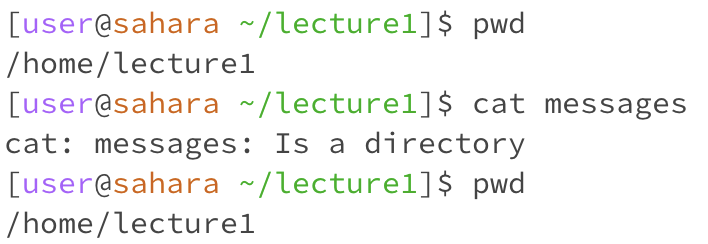
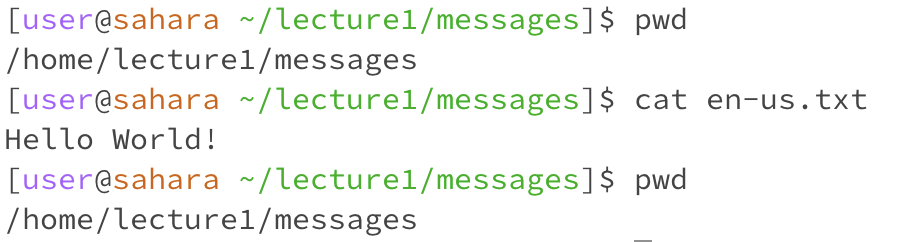

# **Lab Report 1: Remote Access and FileSystem**

Hello and welcome to my first lab report for CSE 15L! This lab report will cover basic commands and demonstrate my knowlage of them. 
As a note please don't mind my horrible spelling; spell cheak seems to not exist on this website for some reason.

   

## Let's start with the command `cd` aka change directory.
1. Let's try to use `cd` without any arguments. In this example I will start with my working directory being /home/lecture1.
   
  

 

> As you can see from the image typing `cd` into the terminal changed the directory path bringing you one directiry "out". This makes
sense because when you type `cd` you're telling the code to change the directory. Without any other instruction, the code takes this as an
intruction to go to the directory "outside" of the currect one. This is what is is expected and therefore no error occured.

   

2. Next, let's use a directory as an argument to cd. In this case we will start out with /home being our working directory.

 

 

> In this case we typed `cd lecture1` in order to go into that directory. This makes sense as cd changes the directory so by adding a directory at the end
it will change to that directory. As a note, this would only work if we were in the correct directory (ex: if our working directory was /home then `cd README`
would not work if README is in the absalute path /home/lecture1/README if that makes sense (assuming README was a directory)). In the specific example screenshotted
no errors appeared.

 

3. Lastly, we will use `cd` with a file as an argument. This will be from the working directory /home/lecture1/messages.

   

   

> For this example, I typed `cd en-us.txt` which is a file in the messages folder in this example. This outputted an error message because the file is not a directory.
This makes sense as cd literally is called change **directory**. As en-us.txt is not a directory the terminal outputted an error.

## Next, let's explore the command `ls` which stands for list.
1. Let's try to use the command ls with no arguments. We will start in the working directory /home/lecture1.

 

 

> By typing `ls` into the terminal, the terminal returned the files and directories inside of lecture1. This makes sense because lecture1 was the current working
directory making it the one that was "listed". This output was not an error and makes sense given the working directory. 

 

2. Now, let's see what happend when pairing `ls` with a directory. In this case the working directory will be /home/lecture1.

 

 

> Using the command `ls messages` results in the files and directories in messages to be listed. This makes sense given that messages containes files and 
is within the scope, so to speak, of lecture1 (the file structure is set up so that /home/lecture1/messages). This output does not produce any errors for those reasons. 

 

3. Finally, let's explore what happens when you use `ls` with a file. The working directory will start as /home/lecture1/messages.

 

 

> When typing in `ls en-us.txt`, the terminal outputted the name of the file back. This result is somewhat unintuitive as it seems odd that by listing the files in
the .txt file it just returned itself. This, however, does make sense as en-us.txt contains no files and, therfore, has nothing inside of it to list. This result is not
an error. 

 

## Lastly, let's talk about the command `cat` which stands for concatenate and prints the contents of a file.
1. Next, lets try to use the `cat` command without an argument. The starting working directory will be /home/lecture1/messages.

 

 

> In this case, by typing just `cat` and pressing enter, nothing happens. Then when you try to type anything and press enter it just regurgitates that
information back to you. Thankfully, I was able to get it to stop copying me by using ctrl d which I found through a quick google search thanks to [this](https://www.google.com/search?q=how+to+stop+cat+in+terminal+from+command+line&oq=how+to+stop+cat+in+terminal+from+co&gs_lcrp=EgZjaHJvbWUqBwgBECEYoAEyBggAEEUYOTIHCAEQIRigATIHCAIQIRigATIHCAMQIRigATIHCAQQIRigATIHCAUQIRirAjIHCAYQIRirAjIHCAcQIRifBdIBCTIwMzE3ajBqOagCALACAA&sourceid=chrome&ie=UTF-8)
pop up (alternativly you could just open another terminal). This is seemingly strange as concatenate should print the contents of a file, however, due to the lack of
file it makes sense. This is probably not an error and was purposely made this way.

 

2. Let's try to use `cat` with a directory and see what happens. For this example, we will start at the working directory /home/lecture1.
   
 

 

> By pairing concatenate with a directory it can't print anything because there are no specific file contents. This ends up resulting in an error statment
stating that it is a directory. This makes sense because as stated it cant realy print any file contents.

   

3. Lastly, let's pair `cat` with a file. In this case, we will start with the working directory being /home/lecture1/messages.
   
 

 

> In this case, by typing `cat en-us.txt`, the contents of en-us.txt are printed. In this case `Hello World!` was printed. This makes sense because cat prints the
contents of a file of which en-us.txt is. This is not an error and is the command just working. 

 

 

Thnaks for reading my lab report!
