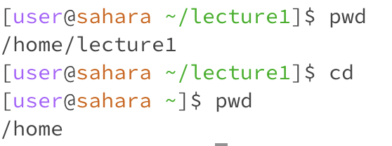

# **Lab Report 1: Remote Access and FileSystem**

![Image] (coolBorder.png)

 

Hello and welcome to my firt lab report for CSE 15L! This lab report will cover basic commands and demonstrate my knowlage of them. 
As a note please don't mind my horrible spelling; spell cheak seems to not exist on this website for some reason.

   

## Let's start with the command `cd` aka change directory.
1. Let's try to use `cd` without any arguments. In this example I will start with my workiong directory being /home/lecture1.
   
  

 

> As you can see from the image typing `cd` into the terminal changed the directory path bringing you one directiry "out". This makes
sense because when you type `cd` you're telling the code to change the directory. Without any other instruction, the code takes this as an
intruction to go to the directory "outside" of the currect one. This is what is is expected and therefore no error occured.

2. hh
