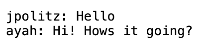

# **Lab Report 2: Servers and SSH Keys**

Welcome to my seccond lab report! In this lab report I will be showing you a server I created 
and SSH Keys. Once again, please don't mind my spelling, I need to figure out how to enable spell 
check on github in the future.

## Chat Web Server:
For this assignment a created a web server that essentially takes the URL and parses a message and 
user from the text in it. Below I have added my code for my ChatServer class. I additionaly used the 
Server.java class from [this](https://github.com/ucsd-cse15l-f23/wavelet) repository. My chat server also
has adapted the NumberServer class for this assignment. 

```
import java.io.IOException;
import java.net.URI;
import java.util.ArrayList; 

class Handler implements URLHandler {
    ArrayList<String> messages = new ArrayList<>();
    ArrayList<String> users = new ArrayList<>();
    StringBuilder output = new StringBuilder();

    /**
     * Takes the typed URL and accordinly decides what to output
     */
    public String handleRequest(URI url) {
        if (url.getPath().equals("/")) {
            //Output the current messages 
            for (int i = 0; i < messages.size(); i++) {
                output.append(users.get(i) + ": " + messages.get(i) + "\n");
            }
            return String.format(output.toString());
        } 
        else {
            if (url.getPath().contains("/add-message")) {
                String[] parameter1 = url.getQuery().split("=");
                // Find message 
                if (parameter1[0].equals("s")) {
                    String str = parameter1[1];
                    messages.add((str.substring(0, str.length() - 5)));
                }
                String[] parameter2 = parameter1[1].split("&");
                // Find user
                if (parameter2[1].equals("user")) {
                    users.add(parameter1[2]);
                }
                output.setLength(0);
                //Output the current messages 
                for (int i = 0; i < messages.size(); i++) {
                    output.append(users.get(i) + ": " + messages.get(i) + "\n");
                }
                return String.format(output.toString());
            }
            return "404 Not Found!";
        }
    }
}

/**
 * Runs the server
 */
class ChatServer {
    public static void main(String[] args) throws IOException {
        if(args.length == 0){
            System.out.println("Missing port number! Try any number between 1024 to 49151");
            return;
        }

        int port = Integer.parseInt(args[0]);

        Server.start(port, new Handler());
    }
}
```

As you can see, I used an array list to store a list of messages and a list of users. I found this 
to be the easist method to store the information. The other varibale at the top of the code is a string 
builder which I used to concatenate the output of strings. 

Now, let's turn our attention to how the code actually works. Let's look at an example output and input! 
In these examples I ran the code on my local machine and a local server (beacuse that was faster) though it 
should work the same on my UCSD account. 

1. Firstly, I typed in the url `http://localhost:4000/add-message?s=Hello&user=jpolitz`. As mentioed prior, the
   URL input tells the code what to do so the message in this case would be "Hello" and the user would be "jpolitz".
   
   
   
    > To get this output the code calls a few methods. These methods are the `main` method and the `handleRequest`
    > method. Seeing as the main method is relativly normal I won't really adress it too much but it takes a string
    > argument from the command line. The expected string to run the server is the port number. The method then takes
    > the port number and uses it to start the server by passing it as an argument to the Server method. The Server
    > method then takes this information and starts the server. No specific values are changed in main other than the
    > port number depending on the argument. In this case I used the port number 4000.
    >
    > In the `handleRequest` method, as mentioned prior, we use the ArrayLists `messages` and `users` to store the
    > collected data along with the StringBuilder `output` which contains what I want to output. Prior to the methods
    > first call these are all uninitialized. In the function, there are basically three options or paths for the function
    > to take. The first is that the URL could be invalid; this just results in a 404 error. The next is that the URL
    > could have nothing past the domain. In my implementation this results in the current messages being printed. If there
    > have been no prior messages nothing prints. The last option the code can handle is the case where the user adds a
    > path and query to their URL formatted correctly (explained on the lab report [website](https://ucsd-cse15l-w24.github.io/week3/index.html)).
    > 

<br>
   
3. Now, to add a new input I typed in the url `http://localhost:4000/add-message?s=Hi!%20Hows%20it%20going?&user=ayah`.
   In this case, the message is "Hi! Hows it going?" and the user is "ayah".
   
   

   h

<br>

## SSH Keys:
h

<br>

## What I Learned:
h

<br>

Thanks for reading my lab report!
