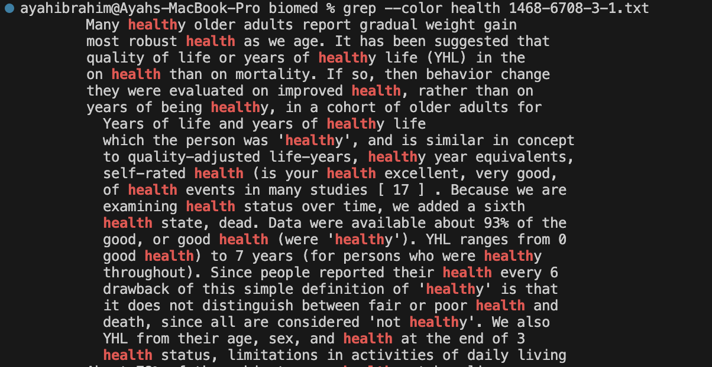

# **Lab Report 3: Bugs and Commands**

Hello and welcome to this lab report. In this report I will be discussing bugs and 
reserching commands. Please ignore my spelling, I am aware that it is not great, but I
cant figure out how to use a spell checher on github.

<br>  

## Bugs:

For this lab, I will be analyzing [this](https://github.com/ucsd-cse15l-f23/lab3) repository fron last
weeks lab. Specifically I will be focusing on `ArrayExamples.java` by testing it with `ArrayTests.java`.
Let's start by adding more tests for `ArrayExamples` to make sure that the function `reverseInPlace` is 
working properly. `reverseInPlace` is sopposed to reverse the order of the elements in an array.

1. Failure inducing input:

> One failure inducing input to this function is passing the integer array `{1, 2, 3, 4, 5}`. Here is the
> code for a test I wrote to test this input.
  
```
@Test
  public void testReverseInPlace1() {
    int[] input1 = {1, 2, 3, 4, 5};
    ArrayExamples.reverseInPlace(input1);
    assertArrayEquals(new int[]{5, 4, 3, 2, 1}, input1) ;
  }
```

> This failure inducing input should result in the array being `{5, 4, 3, 2, 1}` (based on common sense),
> however, it returns `{5, 4, 3, 4, 5}`.

2. Non Failure inducing input:

> Despite that input producing the wrong output, this does not mean that the method fails at every test.
> One non failure inducing input is `{1, 1, 0, 1, 1}`. The code to test that input is shown below.

```
@Test
  public void testReverseInPlace2() {
    int[] input1 = {1, 1, 0, 1, 1};
    ArrayExamples.reverseInPlace(input1);
    assertArrayEquals(new int[]{1, 1, 0, 1, 1}, input1) ;
  }
```

> When this input is passed to the function `reverseInPlace`, it should result in the array being
> `{1, 1, 0, 1, 1}`. This is returned even with our function having a few bugs.

3. The Symptom:

> Next, let's run these tests and see their output. Below is a screenshot of the two tests being run.


> As you can see the symptom of the first test is that the output is `{5, 4, 3, 4, 5}` instead of 
> `{5, 4, 3, 2, 1}`.

4. The Bug:

>  Now let's actually take a look at the code. Below is the code for the `reverseInPlace` function.

```
// Changes the input array to be in reversed order
  static void reverseInPlace(int[] arr) {
    for(int i = 0; i < arr.length; i += 1) {
      arr[i] = arr[arr.length - i - 1];
    }
  }
```

> If you notice, the code (and the output when testing) seems to only reverse the first half of the
> array but not the last. This is illustrated by how the for loop is set up. Beased on the code the
> first elements are changed to the correct value but have their values overwritten, meaning that
> those values are lost and not used to set the last elements. Instead, we need a temprary vauable
> to store that value and set the appropriate value at the end of the array to it. Below is the code
> with that change.

```
// Changes the input array to be in reversed order
  static void reverseInPlace(int[] arr) {
    int temp;
    for(int i = 0; i < arr.length/2; i += 1) {
      temp = arr[i];
      arr[i] = arr[arr.length - i - 1];
      arr[arr.length - i - 1] = temp;
    }
  }
```

> With these changes, this code now passes all of the tests (note that there are additional tests
> not mentioned before)!


## Commands:

For this part of the lab report, I am going to explore the `grep` command because I feel like I don't quite understand 
what it does. According to class, `grep` is used to find a string in a specific file or collection of files. Let's try to 
use it in differnt ways. We will test these command on [this](https://github.com/ucsd-cse15l-f23/lab3) file from the lab 
report instructions.

1. `grep -i <string> <file>`:

> Lets use `grep` with its basic use case. I will use it on the file with the absalute path `/Users/'name'/docsearch/technical/biomed/1468-6708-3-1.txt`.
> I will search for the term `health` using the command `grep -i health 1468-6708-3-1.txt`. This should make grep case insensitive
>  according to [Geeks for Geeks](https://www.geeksforgeeks.org/grep-command-in-unixlinux/). This results in the output:

```
User biomed $ grep -i health 1468-6708-3-1.txt
        Many healthy older adults report gradual weight gain
        most robust health as we age. It has been suggested that
        quality of life or years of healthy life (YHL) in the
        on health than on mortality. If so, then behavior change
        they were evaluated on improved health, rather than on
        years of being healthy, in a cohort of older adults for
          Study design: The Cardiovascular Health
          The Cardiovascular Health Study (CHS) is a
          Years of life and years of healthy life
          which the person was 'healthy', and is similar in concept
          to quality-adjusted life-years, healthy year equivalents,
          self-rated health (is your health excellent, very good,
          of health events in many studies [ 17 ] . Because we are
          examining health status over time, we added a sixth
          health state, dead. Data were available about 93% of the
          good, or good health (were 'healthy'). YHL ranges from 0
          good health) to 7 years (for persons who were healthy
          throughout). Since people reported their health every 6
          drawback of this simple definition of 'healthy' is that
          it does not distinguish between fair or poor health and
          death, since all are considered 'not healthy'. We also
          YHL from their age, sex, and health at the end of 3
          health status, limitations in activities of daily living ...
```

> As you can see this prints all the lines that contain the word `health` regardless of case sensitivity. Now lets try to use
> it with a word that doesnt exit and see what happens. I will search for the term `tree` from the same directory. I will
> use the command `grep -i tree 1468-6708-3-1.txt` while being in the working directory `/Users/'name'/docsearch/technical/biomed`.
> This outputs:

```
User biomed $ grep -i tree 1468-6708-3-1.txt

```

> This does not print anything which makes sense given it is never mentioned in the file.
   
2. `grep -o <string> <file>`:

> Accordng to [Geeks for Geeks](https://www.geeksforgeeks.org/grep-command-in-unixlinux/), adding `-o` to `grep` should print only
> the search term instead of the whole line. Let's try this with the same file we used in the first example and with `-i` as well to
> remove case sensitivity. When giving the command `grep -oi health 1468-6708-3-1.txt` it results in the output:

```
User biomed $ grep -oi health 1468-6708-3-1.txt
health
health
health
health
health
health
Health
Health
health
health
health
...
```

> As you can see it does eaxctly what you would expect. Let's try to use this command but with wc to count the number of words.
> This would be done by using the command `grep -oi health 1468-6708-3-1.txt | wc`.

```
User biomed $ grep -oi health 1468-6708-3-1.txt | wc
      50      50     350
```

> This also seems to work as expected. 
   
3. `grep --color <string> <file>`:

> Now let's try using `--color`. According to [Digital Ocean](https://www.digitalocean.com/community/tutorials/grep-command-in-linux-unix),
> this command is sopposed to color the text that you are finding so that it stands out. To use the command I will type
> `grep --color health 1468-6708-3-1.txt` into the terminal with the working directory being `/Users/'name'/docsearch/technical/biomed`.
> This results in the output (in a screenshot to show the color):



> This clearly colors the key word with red making them pop out. Now let's try this ame thing but search for a longer string. Let's search for
> `the strongest health relationships` and use -i as well to make it not case sensitive. We will use the same file and working directory. By
> typing the command `grep -i-color 'the strongest health relationships' 1468-6708-3-1.txt` it results in the output(in a screenshot to show the color):


> This still works. Note the ` ' ` symbols arround the string. This seems to be nessarary for the command to work (otherwise it assumes that the next words
> are directories or files to search through. 

4. `grep -c <string> <file>`:

> Accoring to [this](https://www.cyberciti.biz/faq/howto-use-grep-command-in-linux-unix/) link `-c` should return the number of times that a
> string is in a file. Let's try this with the same working directory and file we have been using this whole time. We will search for `health`
> and add `-i` to make it case insensitive. Using the command `grep -ic health 1468-6708-3-1.txt`, it outputs:

```
User biomed $ grep -ic health 1468-6708-3-1.txt
47
```

> This also outputs a value that seems to make sense. When I count the number of lines with `grep -i health 1468-6708-3-1.txt`
> I also get 47. Im not sure why in part 2 when I use `grep -oi health 1468-6708-3-1.txt` it results in 50 lines (however that
> indeed is the correct number of lines accoring to my counting). My best guess is that `grep -i health 1468-6708-3-1.txt` only counts
> the number of lines with the key word rather than the number of key words though I'm not sure. Now let's try this again but by
> recursivly searching using `-r`. I will use the working directory `/Users/'name'/docsearch/technical` and search for `health`
> agian. I will enter the command `grep -rc health biomed`. This outputs:

```
User biomed $ grep -rc health biomed
biomed/1472-6807-2-2.txt:0
biomed/1471-2350-4-3.txt:0
biomed/1471-2156-2-3.txt:0
biomed/1471-2156-3-11.txt:0
biomed/1471-2121-3-10.txt:0
biomed/1471-2172-3-4.txt:0
biomed/gb-2002-4-1-r2.txt:0
biomed/gb-2003-4-6-r41.txt:0
biomed/1471-2466-1-1.txt:0
biomed/1471-2199-2-10.txt:0
biomed/1471-2202-2-9.txt:0
biomed/cc991.txt:0
biomed/1471-2369-3-9.txt:1
biomed/bcr620.txt:0
biomed/1476-069X-2-4.txt:46
biomed/1472-6750-3-11.txt:0
biomed/1471-2164-2-9.txt:0
biomed/1471-2091-2-10.txt:0
biomed/gb-2001-2-4-research0010.txt:0
biomed/gb-2003-4-4-r24.txt:1
biomed/1471-213X-2-1.txt:0
biomed/1472-6882-3-3.txt:6
biomed/1471-2407-2-3.txt:19
...
```

> Interestingly, this seems to write the file name and the numebr of occurences next to each other without giving a final
> total. I tried to reverse the order of `-rc` but that didn't do anything.

Overall, this helped be get a better understanding of `grep` and made me realize how many things it can do. Also in case 
you are wondering, I did not use `grep` on directories because it dosent do anything (unless you recursivly search).

Thanks for reading my lab report!
