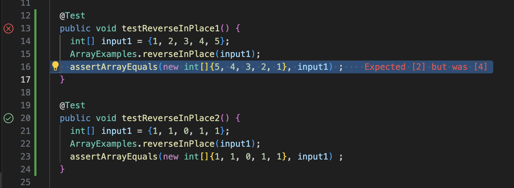
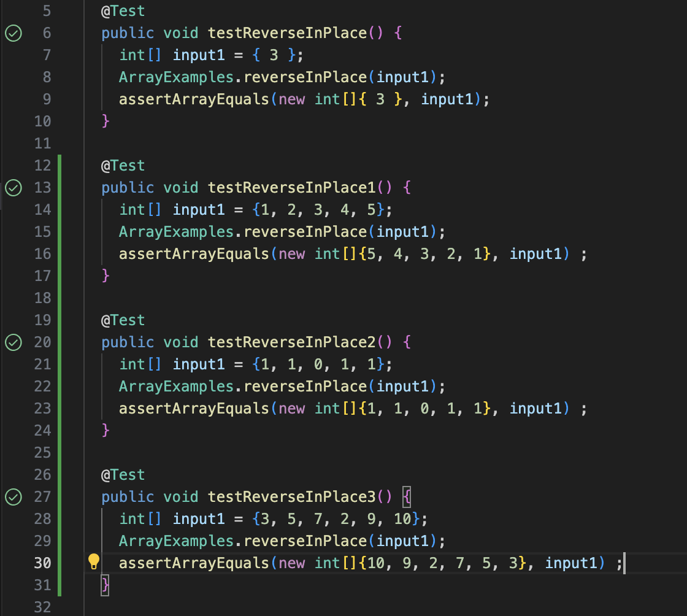

# **Lab Report 3: Bugs and Commands**

Hello and welcome to this lab report. In this report I will be discussing bugs and 
reserching commands. Please ignore my spelling, I am aware that it is not great, but I
cant figure out how to use a spell checher on github.

<br>  

## Bugs:

For this lab, I will be analyzing [this](https://github.com/ucsd-cse15l-f23/lab3) repository fron last
weeks lab. Specifically I will be focusing on `ArrayExamples.java` by testing it with `ArrayTests.java`.
Let's start by adding more tests for `ArrayExamples` to make sure that the function `reverseInPlace` is 
working properly. `reverseInPlace` is sopposed to reverse the order of the elements in an array.

1. Failure inducing input:

> One failure inducing input to this function is passing the integer array `{1, 2, 3, 4, 5}`. Here is the
> code for a test I wrote to test this input.
  
```
@Test
  public void testReverseInPlace1() {
    int[] input1 = {1, 2, 3, 4, 5};
    ArrayExamples.reverseInPlace(input1);
    assertArrayEquals(new int[]{5, 4, 3, 2, 1}, input1) ;
  }
```

> This failure inducing input should result in the array being `{5, 4, 3, 2, 1}` (based on common sense),
> however, it returns `{5, 4, 3, 4, 5}`.

2. Non Failure inducing input:

> Despite that input producing the wrong output, this does not mean that the method fails at every test.
> One non failure inducing input is `{1, 1, 0, 1, 1}`. The code to test that input is shown below.

```
@Test
  public void testReverseInPlace2() {
    int[] input1 = {1, 1, 0, 1, 1};
    ArrayExamples.reverseInPlace(input1);
    assertArrayEquals(new int[]{1, 1, 0, 1, 1}, input1) ;
  }
```

> When this input is passed to the function `reverseInPlace`, it should result in the array being
> `{1, 1, 0, 1, 1}`. This is returned even with our function having a few bugs.

3. The Symptom:

> Next, let's run these tests and see their output. Below is a screenshot of the two tests being run.



> As you can see the symptom of the first test is that the output is `{5, 4, 3, 4, 5}` instead of 
> `{5, 4, 3, 2, 1}`.

4. The Bug:

>  Now let's actually take a look at the code. Below is the code for the `reverseInPlace` function.

```
// Changes the input array to be in reversed order
  static void reverseInPlace(int[] arr) {
    for(int i = 0; i < arr.length; i += 1) {
      arr[i] = arr[arr.length - i - 1];
    }
  }
```

> If you notice, the code (and the output when testing) seems to only reverse the first half of the
> array but not the last. This is illustrated by how the for loop is set up. Beased on the code the
> first elements are changed to the correct value but have their values overwritten, meaning that
> those values are lost and not used to set the last elements. Instead, we need a temprary vauable
> to store that value and set the appropriate value at the end of the array to it. Below is the code
> with that change.

```
// Changes the input array to be in reversed order
  static void reverseInPlace(int[] arr) {
    int temp;
    for(int i = 0; i < arr.length/2; i += 1) {
      temp = arr[i];
      arr[i] = arr[arr.length - i - 1];
      arr[arr.length - i - 1] = temp;
    }
  }
```

> With these changes, this code now passes all of the tests (note that there are additional tests
> not mentioned before)!



## Commands:
