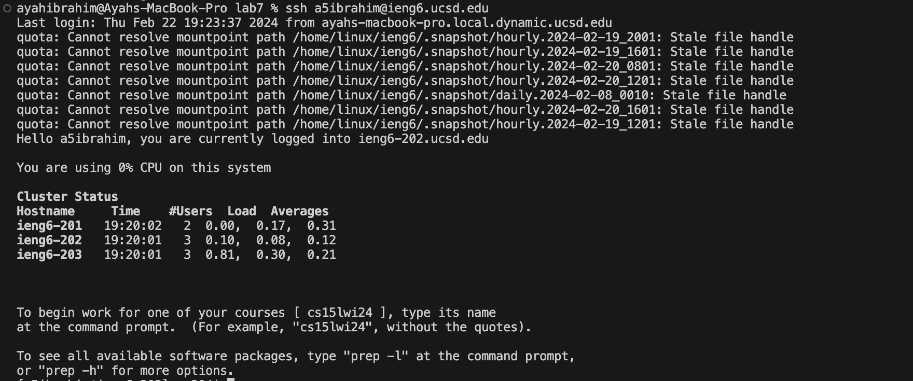
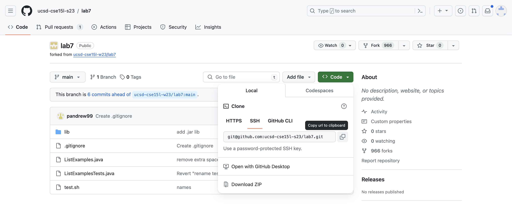
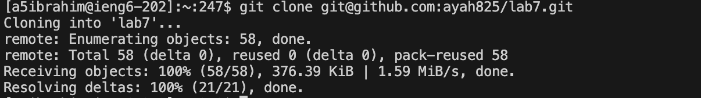
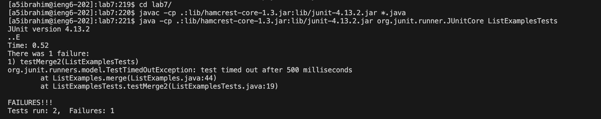
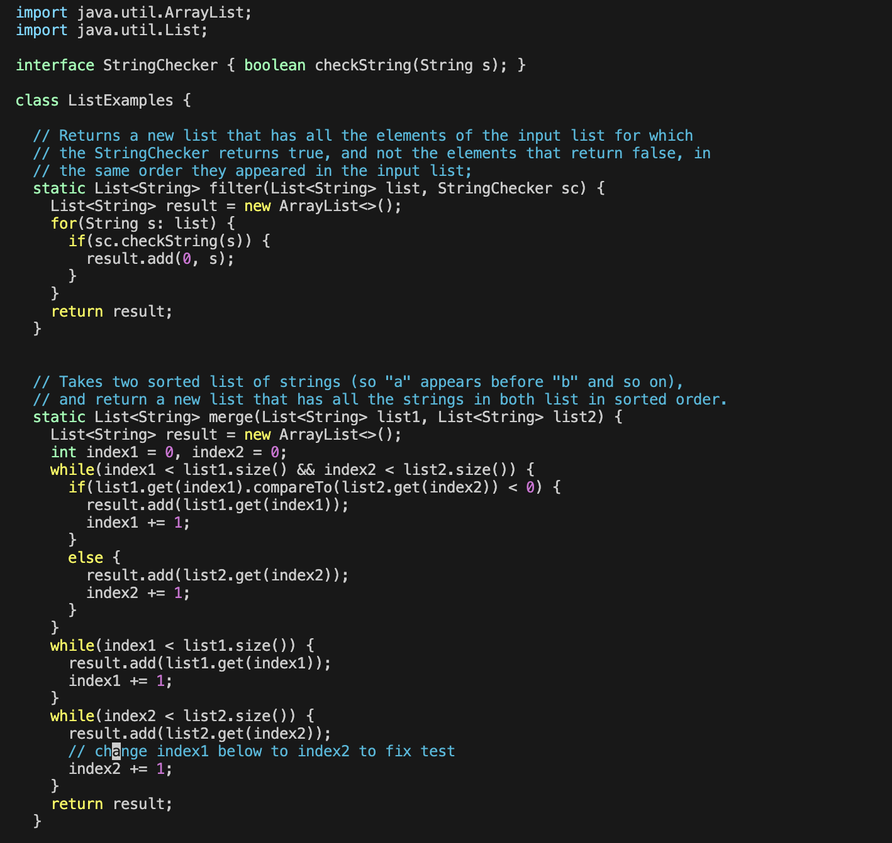
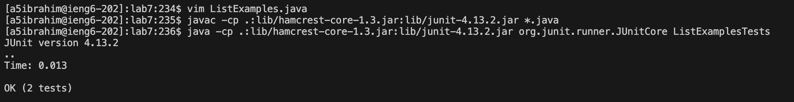

# **Lab Report 4: Vim**

Hello and welcome to this lab report. In this report I will be talking about vim.
Please ignore my spelling, I am aware that it is not great, but I
cant figure out how to use a spell checker on github.

I will follow these steps and document what I did for each step from 4 - 9. These steps can 
also be found in the Lab Report writeup [here](https://ucsd-cse15l-w24.github.io/week7/index.html).

1. Setup Delete any existing forks of the repository you have on your account
2. Setup Fork the repository
3. The real deal Start the timer!
4. Log into ieng6
5. Clone your fork of the repository from your Github account (using the `SSH` URL)
6. Run the tests, demonstrating that they fail
7. Edit the code file to fix the failing test
8. Run the tests, demonstrating that they now succeed
9. Commit and push the resulting change to your Github account (you can pick any commit message!)

   

## Step 4: Logging into ieng6

Let's start with the sequence of commands run.

`<up arrow>` (pressing the up arrow accesses the previous history and so the command `ssh a5ibrahim@ieng6.ucsd.edu` was one up in history) 
`<enter>`

Typing this signs into my ieng account.

## Step 5: Cloning the fork of the repository from your Github account (using the `SSH` URL)

Now I will clone the fork of the [repository](https://github.com/ucsd-cse15l-s23/lab7) provided in 
the lab write up using the `SSH` URL. First I went to my fork of the repository and clicked:

`<Code>` `<SSH>` and copying the `URL` by pressing `<command>` `c` at the same time

Now I am going to clone this so that I can work with it (I cloned it from my personal fork unlike the screenshot). In my terminal I will type:

`git clone ` then at the same time press `<command>` and `v` then press `<enter>` (this should paste the link you copied)

This now has cloned the repository into our machine so that we can actualy modify it.

## Step 6: Running the tests, demonstrating that they fail

First we actually have to get into the file. To do that we type:

`cd` `<space>` `l` `<tab>` `<enter>` (tab autofills in `lab7/`)

Now lets compile and run the tests. To do that I typed:

`<control>` and `<r>` (at the same time) `javac` (which searches for javac in previous commands and effectivly typed the command 
`javac -cp .:lib/hamcrest-core-1.3.jar:lib/junit-4.13.2.jar *.java`) then press `<enter>`

`<control>` and `<r>` (at the same time) `java -` (again it seraches for `java -` in previous command run in history and finds the command
`java -cp .:lib/hamcrest-core-1.3.jar:lib/junit-4.13.2.jar org.junit.runner.JUnitCore ListExamplesTests` then press `<enter>`

This compiled and ran the tests sucsessfuly. As you can see it has 1 error.

## Step 7: Editing the code file to fix the failing test

Now lets use vim to edit the error. The error is in the File `ListExamples.java` so we will try to edit that file.

`vim L` `<tab>` `.` `<tab>` `<enter>` (every time you enter tab it autofills as much as possible so you effectivly end up typing
the command `vim ListExamples.java`).

Now let's actually edit the file in vim. To go down to the error press the `<down arrow>` until you get to line 44 (43 times).
Now you want to get your cursor to hover over the number 1. To do that press the `<right arrow>` (11 times).

To relpace the 1 and make it a 2 (to fix the bug) press `r` `2`. Now line 44 in the code should look like `index2 += 1;`. 

Now to save and exit vim type `:wq` `<enter>`. This should take you back to the terminal.

This should have corrected the issue.

## Step 8: Running the tests, demonstrating that they now succeed

To run the tests we will do the same thing as in step 6 to run the tests. To compile and run the tests type:

`<control>` and `<r>` (at the same time) `javac` (which searches for javac in previous commands and effectivly typed the command 
`javac -cp .:lib/hamcrest-core-1.3.jar:lib/junit-4.13.2.jar *.java`) then press `<enter>`

`<control>` and `<r>` (at the same time) `java -` (again it seraches for `java -` in previous command run in history and finds the command
`java -cp .:lib/hamcrest-core-1.3.jar:lib/junit-4.13.2.jar org.junit.runner.JUnitCore ListExamplesTests` then press `<enter>`

As you can see the tests succeed!

## Step 9: Commiting and pushing the resulting change to your Github account

Now we want to commit these changes to our Github account. To do this type this seris of commands:

`git add L` `<tab>` `<enter>` (pressing tab autofills so that trhe command entered is `git add ListExamples.java`)

`git commit -m "Fixed bugs in ListExamples.java"` (commits the change with the specified message)

`git push` (pushes the change to GitHub account)

This should commited the change to my GitHub account successfuly.

I am aware that some of these may not have been the most effecient way to enter commands or edit in vim but 
this is how I would do the steps. Thank you for reading my lab report!
