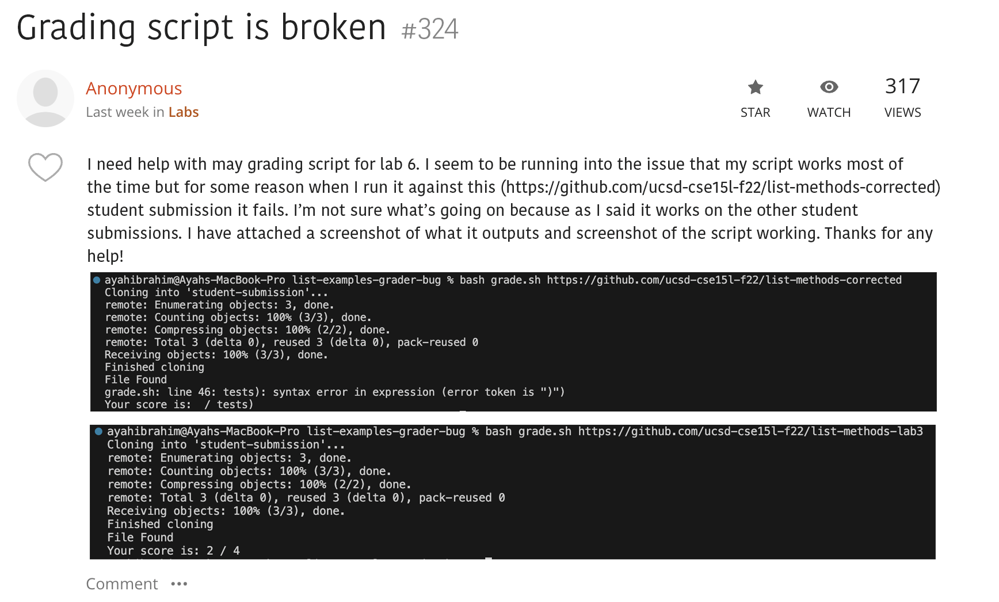

# **Lab Report 5: Putting it all together**

Welcome to the fifth and final lab report for this class. As per usual, please ignore any misspellings, I 
can't figure out how to enable spell ckeck on here and my spelling is quite bad. For this lab report I will 
be creating a fake debugging scenario and reflecting on the last lab. 

   

## Debugging Scenario

In this scenario I will be making up a fake case of a student question on the website EdStem. I will then
go on to simulate giving feedback to a student and helping them through their issue. In this case I will create
a post regarding the [grading script](https://ucsd-cse15l-w24.github.io/week6/index.html) part of lab 6. 

I will start by showing you the post and give you inside knowlage as to the code on the backend that may or not be shared 
on EdStem. Then we'll go through the exachange on EdStem and the changes needed to make the code work. Below is the first 
post (I photoshoped these to make them look like EdStem posts because I thought it would be fun).

   

Thanks!
