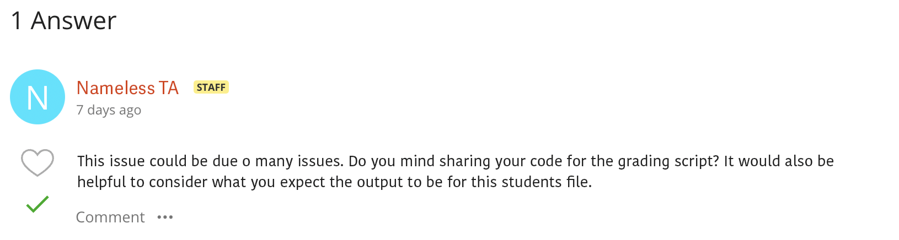
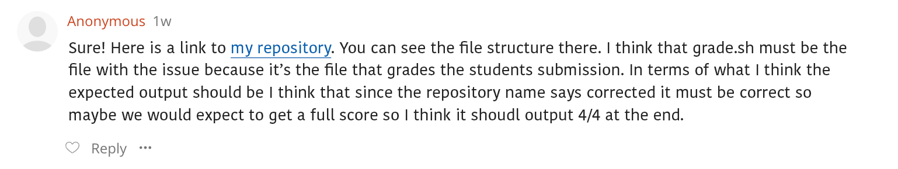
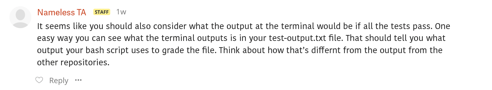
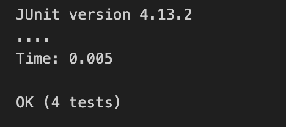
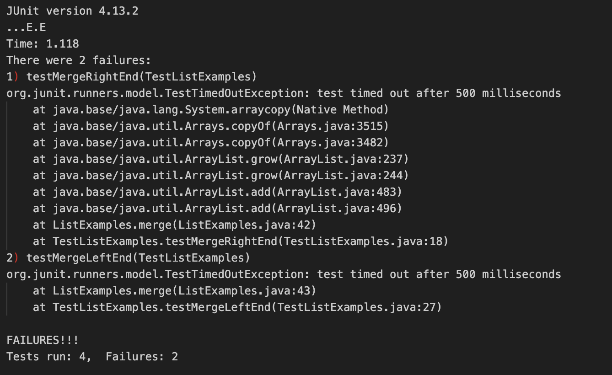
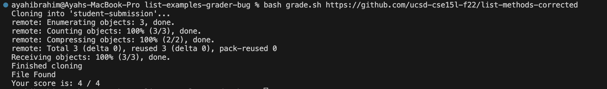

# **Lab Report 5: Putting it all together**

Welcome to the fifth and final lab report for this class. As per usual, please ignore any misspellings, I 
can't figure out how to enable spell ckeck on here and my spelling is quite bad. For this lab report I will 
be creating a fake debugging scenario and reflecting on the last lab. 

<br>  

## Debugging Scenario

In this scenario I will be making up a fake case of a student question on the website EdStem. I will then
go on to simulate giving feedback to a student and helping them through their issue. In this case I will create
a post regarding the [grading script](https://ucsd-cse15l-w24.github.io/week6/index.html) part of lab 6. 

I will start by showing you the post and give you inside knowlage as to the code on the backend that may or not be shared 
on EdStem. Then we'll go through the exachange on EdStem and the changes needed to make the code work. Below is the first 
post (I photoshoped these to make them look like EdStem posts because I thought it would be fun).


As you can see the student seems to be runing into an issue when they type `bash grade.sh https://github.com/ucsd-cse15l-f22/list-methods-corrected`
as it doesnt output the grade correctly. Instead the terminal prints 

```
Cloning into 'student-submission'...
remote: Enumerating objects: 3, done.
remote: Counting objects: 100% (3/3), done.
remote: Compressing objects: 100% (2/2), done.
remote: Total 3 (delta 0), reused 3 (delta 0), pack-reused 0
Receiving objects: 100% (3/3), done.
Finished cloning
File Found
grade.sh: line 46: tests): syntax error in expression (error token is ")")
Your score is:  / tests)
```

The student seems to be confused because the grading script still works with the other student submissions just not this one. 
Obviously, at the moment there is not realy too much information to go off on so we need more information. Before we proceed,
however, I will share the students `grade.sh` file contents so that you can have context as the exchange goes on. This buggy 
code can also be accessed in [this repository](https://github.com/ayah825/list-examples-grader-bug/tree/main). 

```
CPATH='.:lib/hamcrest-core-1.3.jar:lib/junit-4.13.2.jar'

rm -rf student-submission
rm -rf grading-area

mkdir grading-area

git clone $1 student-submission
echo 'Finished cloning'

# if found file
if [[ -f student-submission/ListExamples.java ]] 
then 
    cp student-submission/ListExamples.java grading-area/
    echo "File Found"
else 
    echo "File ListExamples.java not found"
    exit 1
fi

# put things into grading area
cp -r lib grading-area/

cp TestListExamples.java grading-area/

cd grading-area

# compile
javac -cp $CPATH *.java

if [[ $? -ne 0 ]] 
then 
    echo "The program failed to complile"
    exit 1
fi

# run code
java -cp $CPATH org.junit.runner.JUnitCore TestListExamples > test-output.txt

# get test results and output them
TESTRESULTS=$(cat test-output.txt | tail -n 2 | head -n 1)

TESTSRUN=$(echo $TESTRESULTS | awk -F '[, ]'  '{print $3}')
FAILURES=$(echo $TESTRESULTS | awk -F '[, ]'  '{print $6}')

SUCSESS=$(( TESTSRUN - FAILURES ))

echo "Your score is: $SUCSESS / $TESTSRUN "
```

I actually made this mistake in that lab and so I can tell you that the reason it's not working is because the grading script
assumes that all outputs fail, when in reality because this student submission is completly correct it has different outputs 
that require an extra case (that might not make sense at the momement but as the student exchage goes on hopfully this will
make sense). 

At the moment, however, the TA does not know this information because the student did not share their code. This could be many things 
like perhaps some strange aftereffect of not removing a files from the grading area, the issue mentioned above, or any one of another
myriad of issues. Let's get back to our exchange and see what the (fictional) TA responds. Once again this is a photoshopped respnse.








As you can see, in this completly not real situation, the student ended up figuring out their issue. To elaborate on the fake TA's
suggestion to check the `test-output.txt` file in the repository this shows the issue because that file contains the terminal 
output after a given command is run. Below are two screenshots of what the output is when we grade a full grade submission verses 
a file that fails some tests to illustrate the reason the code fails visualy. 





In case it's not clear, when code does not fail any tests the output is very differnt to that that is expected when the code fails 
a few tests. If you look at the code it tailors to the case when tests are failed and does not consider the case when all tests succeed.
The fixed code is below (the changes are in the last few lines of code).

```
CPATH='.:lib/hamcrest-core-1.3.jar:lib/junit-4.13.2.jar'

rm -rf student-submission
rm -rf grading-area

mkdir grading-area

git clone $1 student-submission
echo 'Finished cloning'

# if found file
if [[ -f student-submission/ListExamples.java ]] 
then 
    cp student-submission/ListExamples.java grading-area/
    echo "File Found"
else 
    echo "File ListExamples.java not found"
    exit 1
fi

# put things into grading area
cp -r lib grading-area/

cp TestListExamples.java grading-area/

cd grading-area

# compile
javac -cp $CPATH *.java

if [[ $? -ne 0 ]] 
then 
    echo "The program failed to complile"
    exit 1
fi

# run code
java -cp $CPATH org.junit.runner.JUnitCore TestListExamples > test-output.txt

# get test results and output them
TESTRESULTS=$(cat test-output.txt | tail -n 2 | head -n 1)

if [[ $(echo $TESTRESULTS | awk -F '[ ]'  '{print $1}') == 'OK' ]]
then
    TESTSRUN=$(echo $TESTRESULTS | awk -F '[( ]'  '{print $3}')
    FAILURES=0
else
    TESTSRUN=$(echo $TESTRESULTS | awk -F '[, ]'  '{print $3}')
    FAILURES=$(echo $TESTRESULTS | awk -F '[, ]'  '{print $6}')
fi

SUCSESS=$(( TESTSRUN - FAILURES ))

echo "Your score is: $SUCSESS / $TESTSRUN "
```

As you can see these changes accounted for that difference in output depending on if all tests pass or not. Essentially, I added an 
if statment to determine if the output contains `OK`. If that is the case then only the number of tests passed are printed and so
we need to set `FAILURES` to 0 (bacause all the tests were passed). The number of tests is also written in a differnt format to when
a test fails so we need to account for that as well. 

To adress the fact that the writeup mentions to indlude a screenshot of the code working you can find that below.



## Reflection

In terms of cool things I enjoyed/learned in the seccond half of this class, I firstly enjoyed photshopping the EdStem posts for this 
lab report. I havent done that in a while so it was fun to dust out my editing skills (basicaly it was a good excuse to do something fun).
Aside from that, being able to commit changes to GitHub from the terminal has also been very helpful to me. I would also say that debbugging
is a very helpful tool and I like that this class went more in depth into it. I'm not going to lie, I was aware of debbugging prior to this 
and used tools on my IDE's (which I still prefer to the command line), however, it was nice to get more details about how they work. 

<br>  

Thank you for taking the time to read my lab report! Have a good sping break!
